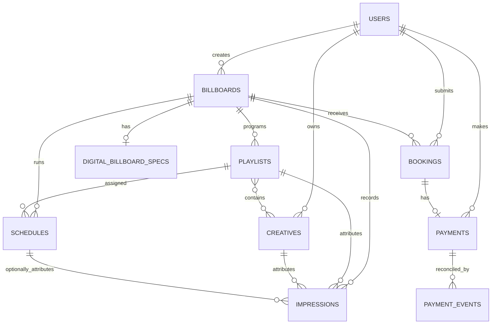

# Data model

MongoDB collections use string references between modules rather than populated Mongoose
relationships. Services validate referential integrity before writes.

## Collections

### `users`

| Field                   | Type                  | Notes                                  |
| ----------------------- | --------------------- | -------------------------------------- |
| `firstName`, `lastName` | string                | Required                               |
| `email`                 | string                | Lowercase, unique, indexed             |
| `passwordHash`          | string                | Required, excluded from normal queries |
| `role`                  | `admin \| advertiser` | Indexed                                |
| `isActive`              | boolean               | Indexed, defaults to true              |
| timestamps              | date                  | Mongoose timestamps                    |

### `billboards`

| Field          | Type                | Notes                                      |
| -------------- | ------------------- | ------------------------------------------ |
| `name`         | string              | Required                                   |
| `code`         | string              | Unique and indexed                         |
| `description`  | string              | Optional                                   |
| `type`         | `static \| digital` | Indexed                                    |
| `location`     | object              | Address, city, country                     |
| `dimensions`   | object              | Positive width/height and `m` or `ft`      |
| `monthlyPrice` | number              | Positive USD media rate                    |
| `trafficCount` | number              | Required positive monthly traffic          |
| `status`       | enum                | Available, reserved, occupied, maintenance |
| `images`       | string[]            | Local paths or secure URLs                 |
| `createdBy`    | string              | Optional user id                           |
| timestamps     | date                | Mongoose timestamps                        |

Indexes: code, type, location city/country, status, and creation timestamp sorting.

### `digital_billboard_specs`

One record per digital billboard.

| Field                 | Type                      |
| --------------------- | ------------------------- |
| `billboardId`         | unique indexed string     |
| `resolution`          | positive width and height |
| `brightness`          | positive number           |
| `slotDurationSeconds` | positive number           |
| `rotatingAdsCount`    | positive integer          |
| `screenStatus`        | on, off, standby, fault   |

### `bookings`

| Group    | Important fields                                               |
| -------- | -------------------------------------------------------------- |
| Identity | `billboardId`, `advertiserId`                                  |
| Campaign | name, objective, target audience, brief, notes                 |
| Window   | `startDate`, `endDate`                                         |
| Creative | optional secure URL, image/document/video type, video duration |
| Billing  | contact name, email, phone, optional VAT number                |
| Company  | name, address, country, optional commercial register           |
| Payment  | method, invoice preferences, optional Stripe reference IDs     |
| Pricing  | days, daily rate, subtotal, service fee, VAT, total, currency  |
| Workflow | pending, approved, rejected, completed, cancelled              |

Indexes:

- `billboardId`
- `advertiserId`
- `status`
- compound `{ billboardId, startDate, endDate }` for conflict detection

`stripeCustomerId`, `stripeSetupIntentId`, and `stripePaymentMethodId` contain provider references
only, and are populated solely on reservations created before card collection moved after approval.
Card number, expiry, and CVC are entered on Stripe Checkout and are never stored in MongoDB.

### `creatives`

| Field             | Type                        | Notes              |
| ----------------- | --------------------------- | ------------------ |
| `advertiserId`    | indexed string              | Owner              |
| `name`            | string                      | Required           |
| `type`            | image or video              | Indexed            |
| `assetUrl`        | HTTPS URL                   | Required           |
| `durationSeconds` | positive number below 10    | Required for video |
| `status`          | pending, approved, rejected | Indexed            |

### `payments`

One payment ledger record per booking.

| Field                                           | Notes                                        |
| ----------------------------------------------- | -------------------------------------------- |
| `bookingId`                                     | Unique booking reference                     |
| `advertiserId`                                  | Indexed payer reference                      |
| `provider`                                      | `stripe` or `manual`                         |
| Stripe session, PaymentIntent, and refund ids   | Optional, sparse unique indexes              |
| `amount`, `amountPaid`, `currency`              | Expected total and received balance          |
| `status`                                        | Payment and refund lifecycle                 |
| `paymentMethod`                                 | Card, bank transfer, e-wallet, or cash       |
| `checkoutAttempt`, `refundAttempt`              | Idempotent provider-operation counters       |
| `note`, `recordedBy`                            | Optional manual reconciliation audit context |
| `expiresAt`, `paidAt`, `refundedAt`, timestamps | Payment lifecycle timestamps                 |

### `payment_events`

Stores unique Stripe event IDs and event types after successful processing. Duplicate event
deliveries therefore do not repeat fulfillment.

### `playlists`

| Field         | Type            | Notes             |
| ------------- | --------------- | ----------------- |
| `billboardId` | indexed string  | Digital billboard |
| `name`        | string          | Required          |
| `status`      | draft or active | Indexed           |
| `creativeIds` | string[]        | Ordered, 1–50 ids |

### `schedules`

| Field              | Type                   | Notes                    |
| ------------------ | ---------------------- | ------------------------ |
| `billboardId`      | indexed string         | Digital billboard        |
| `playlistId`       | indexed string         | Must belong to billboard |
| `startAt`, `endAt` | date                   | UTC timestamp window     |
| `status`           | scheduled or cancelled | Indexed                  |

Compound index `{ billboardId, startAt, endAt }` supports overlap and now-playing queries.

### `impressions`

| Field         | Type            |
| ------------- | --------------- |
| `billboardId` | indexed string  |
| `playlistId`  | indexed string  |
| `creativeId`  | indexed string  |
| `scheduleId`  | optional string |
| `occurredAt`  | indexed date    |

Compound indexes support per-screen and per-creative time-ordered analytics.

## Integrity strategy

MongoDB does not enforce these cross-collection references. Services must validate them before
mutations. Deleting referenced resources can leave stale ids unless the owning service performs
cleanup. Any new delete path must define its cascade or retention behavior explicitly.

## Migration policy

There is no migration runner yet. Until one is introduced:

1. Prefer additive schema changes.
2. Backfill existing records before making a field required.
3. Deploy readers that tolerate both shapes before writers emit the new shape.
4. Record manual data migrations in the release notes and operations log.

Existing payment records created before provider, amount-paid, and attempt fields were introduced
are read with backward-compatible defaults. Backfill them before making those fields strictly
required at the database level.
