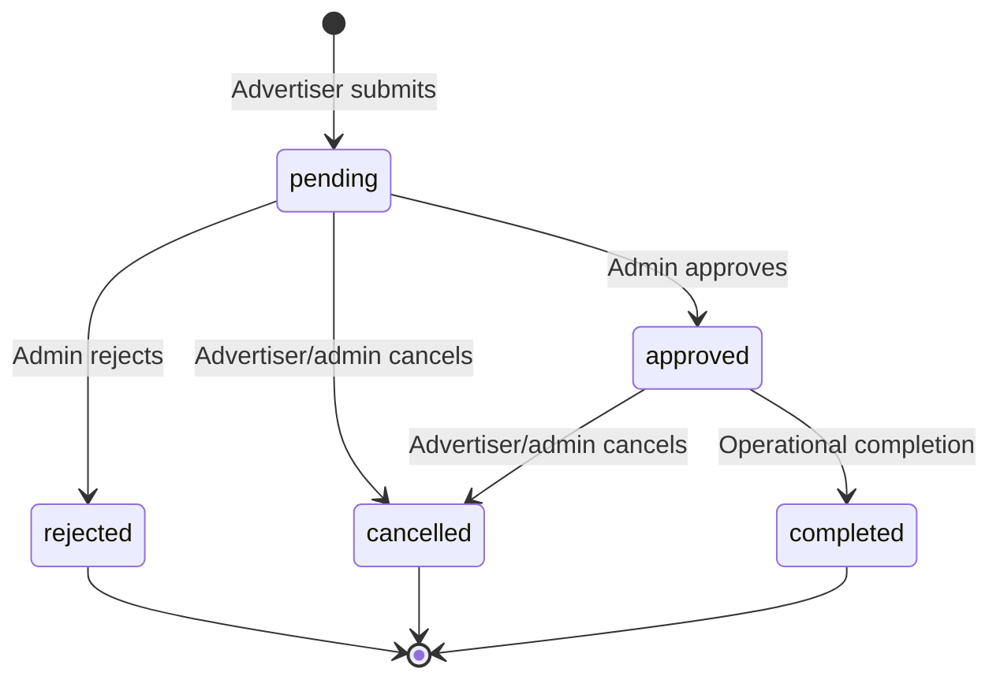

# Domain modules

## Module map

| Module      | Purpose                                                    | Primary actors            |
| ----------- | ---------------------------------------------------------- | ------------------------- |
| Auth        | Credentials login, JWT sessions, token lifecycle           | Guest, admin, advertiser  |
| Users       | Account creation and profile persistence                   | Admin, advertiser         |
| Billboards  | Inventory, availability, images, digital specifications    | Public, admin, advertiser |
| Bookings    | Reservation requests, pricing, conflict checks, moderation | Admin, advertiser         |
| Payments    | Card checkout, reconciliation, refunds, payment ledger     | Admin, advertiser, Stripe |
| Creatives   | Image/video assets and approval workflow                   | Admin, advertiser         |
| Playlists   | Ordered creative sets for digital screens                  | Admin                     |
| Schedules   | Time windows assigning playlists to screens                | Admin                     |
| Rotation    | Resolved playback sequence and now-playing contract        | Admin, screen device      |
| Impressions | Playback event ingestion and analytics                     | Admin, screen device      |
| Uploads     | Short-lived ImageKit upload credentials                    | Authenticated users       |

## Auth

Auth.js is configured in `src/server/modules/auth/config.ts` and exposed through the thin
`src/auth.ts` facade. Credentials are validated with Zod, checked against bcrypt hashes, and
converted into JWT-backed sessions carrying the user id, role, active state, and opaque access
token metadata.

The catch-all Auth.js endpoint is `/api/auth/[...nextauth]`. Product-facing JSON wrappers are under
`/api/v1/auth`.

## Billboards

The billboard module owns static and digital inventory. Admins can create, update, change
availability, manage images, and delete inventory. Authenticated advertisers can read internal
inventory; public consumers receive a safe projection.

Digital specifications include resolution, brightness, slot duration, rotating-ad count, and
operational screen status. Public projections omit screen status.

Key rules:

- Inventory is currently constrained to Lebanon by the shared contract.
- Monthly price, dimensions, and monthly traffic must be positive.
- A billboard code is unique and normalized to uppercase.
- Only digital billboards may have digital specifications.
- A billboard is publicly bookable only when its status is `available`.

## Bookings

Bookings represent reservation requests, not captured payments.

Lifecycle:



Implemented status mutations expose approval, rejection, and cancellation. `completed` exists in
the domain enum but currently has no dedicated public status endpoint.

Conflict behavior:

- Pending requests do not block the calendar.
- Approved requests block overlapping dates.
- Static inventory allows one concurrent approved reservation per day.
- Digital inventory allows six concurrent approved reservations per day.
- Capacity is checked when a request is submitted and again when an admin approves it.

Pricing is authoritative on the server:

```text
dailyRate = monthlyPrice / 30
subtotal = dailyRate × inclusiveDays
serviceFee = subtotal × 5.5%
vat = (subtotal + serviceFee) × 11%
total = subtotal + serviceFee + vat
```

## Payments

Approved reservations can be paid by Stripe-hosted card checkout. Pending requests cannot be
charged, so conflict moderation happens before money is collected. The server creates short-lived
Checkout Sessions using the booking's authoritative amount and verifies successful returns
server-side.

Signed Stripe webhooks and the success-page verification both call the same idempotent
reconciliation logic. Admins can reconcile offline methods and issue full Stripe refunds. Full
refunds cancel the reservation only after Stripe confirms success.

See [Payments](../guides/payments.md) for status transitions, permissions, setup, and operations.

## Creatives

Advertisers create and manage their own image or video creatives. Admins read all creatives,
moderate them as approved/rejected, and can delete them. Video assets require an explicit duration;
asset URLs must use HTTPS.

Ownership is enforced in the service layer. Newly created creatives always begin as `pending`.

## Playlists

A playlist belongs to one digital billboard and contains between one and fifty creative ids.
Admins create and manage playlists. The service verifies that the billboard is digital and that
all referenced creatives exist.

Statuses:

- `draft`
- `active`

The current implementation validates existence but does not yet require every creative to be
approved before playlist inclusion. See [Known limitations](../known-limitations.md).

## Schedules

A schedule assigns a playlist to a digital billboard for a timestamp window. Only admins manage
schedules.

Rules:

- The billboard must be digital.
- The playlist must belong to the same billboard.
- End time must be after start time.
- Non-cancelled schedules cannot overlap on the same screen.
- Updating a schedule reruns duration, ownership, and overlap checks.

## Rotation

Rotation resolves a schedule into an ordered sequence of creative assets and durations.

- Admin preview: `GET /api/v1/schedules/{scheduleId}/rotation`
- Screen polling: `GET /api/v1/public/screens/{billboardId}/now-playing`

When no schedule is active, the screen contract returns `playing: false` with a server timestamp.
Images use the default ten-second slot unless the creative supplies a duration.

## Impressions

Screen devices post a playback event after a creative is shown. The service validates the full
reference chain:

1. Billboard exists and is digital.
2. Playlist exists and belongs to the billboard.
3. Creative id appears in the playlist.
4. Creative exists.

Admins can aggregate impressions by billboard, playlist, or creative and receive totals,
per-creative counts, and the twenty most recent events.

## Uploads

The upload module returns short-lived ImageKit signature material to authenticated users. The
private key stays on the server; the browser uploads directly to ImageKit with the returned token,
signature, expiry, and public key.
