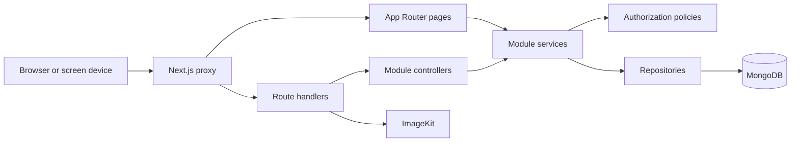
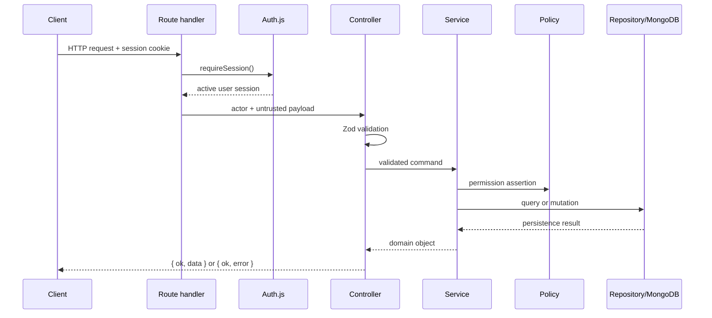

# Architecture overview

## System shape

Boardly is a modular monolith deployed as one Next.js application. Public pages, authenticated
dashboards, API handlers, domain services, and persistence adapters live in the same repository,
while module boundaries keep business logic independently maintainable.



## Layer responsibilities

| Layer            | Location                               | Responsibility                                                 |
| ---------------- | -------------------------------------- | -------------------------------------------------------------- |
| Routing          | `src/app`                              | URL composition, request extraction, server-page composition   |
| Feature UI       | `src/client/features`                  | Screens, forms, feature components, browser state, API clients |
| Shared UI        | `src/client/ui`                        | Customized shadcn primitives and UI utilities                  |
| Controllers      | `src/server/modules/*/*.controller.ts` | Contract validation and HTTP-oriented orchestration            |
| Services         | `src/server/modules/*/*.service.ts`    | Business rules, authorization, transactions, coordination      |
| Repositories     | `src/server/modules/*/*.repository.ts` | MongoDB reads, writes, filters, and aggregations               |
| Models           | `src/server/modules/*/*.model.ts`      | Mongoose schemas, collection names, and indexes                |
| Shared contracts | `src/shared/contracts`                 | Zod request contracts used across client and server            |
| Policies         | `src/shared/policies`                  | Central role and permission decisions                          |
| HTTP helpers     | `src/server/http`                      | JSON envelopes, session guard, normalized errors               |

## Request lifecycle

### Authenticated API request



### Server-rendered public page

Public catalog pages call the billboard service directly from Server Components. Public service
methods return explicitly reduced projections so operational fields such as internal status,
billboard code, timestamps, and digital screen state do not leak into the storefront.

## Runtime boundaries

- `src/proxy.ts` runs in the Edge runtime and performs only coarse cookie-presence checks.
- Server layouts and services perform authoritative authentication and role checks in Node.js.
- Mongoose and the Auth.js MongoDB adapter run only in Node.js contexts.
- Public screen endpoints are unauthenticated device contracts and therefore require additional
  production hardening described in [Known limitations](../known-limitations.md).

## Data and time

- MongoDB is the system of record.
- Domain timestamps are persisted in UTC.
- Reservation dates are stored as dates and treated as inclusive calendar-day ranges.
- Schedule windows are timestamp ranges and use the standard overlap rule:
  `existing.start < requested.end && existing.end > requested.start`.
- Client-computed prices are previews only; booking totals are recomputed by the server.

## API conventions

Successful responses:

```json
{ "ok": true, "data": {} }
```

Failed responses:

```json
{ "ok": false, "error": "Human-readable message." }
```

Typical status mapping:

| Status | Meaning                                                      |
| ------ | ------------------------------------------------------------ |
| `200`  | Successful read or update                                    |
| `201`  | Resource created                                             |
| `400`  | Invalid payload or business precondition                     |
| `401`  | Missing or invalid authentication                            |
| `403`  | Authenticated but not authorized                             |
| `404`  | Resource not found or malformed identifier                   |
| `409`  | Unique constraint, reservation conflict, or schedule overlap |
| `500`  | Unexpected internal failure                                  |
| `503`  | Optional integration unavailable                             |

## Architectural invariants

1. App Router files compose features and delegate; they do not own domain rules.
2. Services are the second authorization gate after route/layout authentication.
3. Database access flows through repositories.
4. Shared request shapes are Zod contracts under `src/shared/contracts`.
5. Client-supplied roles, ownership identifiers, prices, and operational status are never trusted.
6. Inactive users must be rejected by authentication and protected services.
7. Breaking contract changes require documentation and consumer updates in the same change.
