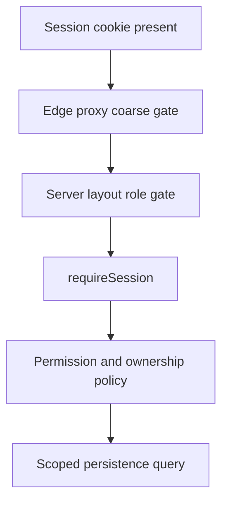

# Authentication and authorization

## Authentication model

Boardly uses Auth.js credentials authentication with JWT sessions.

1. The login payload is validated by `loginSchema`.
2. The user is loaded by normalized email.
3. bcrypt verifies the password hash.
4. Inactive accounts are rejected.
5. Auth.js stores session state in an encrypted, HTTP-only cookie.
6. The session callback exposes id, role, active state, first name, and last name.

Auth.js protocol routes live at `/api/auth/[...nextauth]`; application-oriented wrappers live under
`/api/v1/auth`.

## Roles

### Advertiser

- Access advertiser dashboard
- Read billboard inventory
- Submit, read, and cancel owned reservations
- Create, read, update, and delete owned creatives

### Admin

- Access admin dashboard
- Manage billboard inventory and digital specifications
- Read and moderate reservations
- Read, moderate, and delete creatives
- Manage playlists and schedules
- Preview rotations and read impression analytics
- Manage users where policy permits

The canonical mapping is:

- `src/shared/constants/permissions/permissions.ts`
- `src/shared/constants/permissions/admin-permissions.ts`
- `src/shared/constants/permissions/advertiser-permissions.ts`

## Defense layers

- The proxy only checks cookie presence and must not be treated as authoritative.
- Server layouts prevent users from rendering the wrong dashboard area.
- Authenticated route handlers call `requireSession()`.
- Services assert permissions and ownership even if called outside HTTP.
- Repositories receive already-scoped filters where appropriate.

## Ownership rules

- Advertisers see only their own bookings and creatives.
- Admin reservation creation, booking moderation, and creative moderation are permission-based.
- Public billboard projections omit internal operational fields.
- Server-generated actor ids override any client ownership claim.
- Booking prices are derived from current billboard data, not request totals.

## Session and token behavior

The JWT stores an opaque refresh token and short-lived opaque access token metadata. These tokens
are not currently used to call a separate resource server; they support the session API contract.

Required TTL configuration:

- `ACCESS_TOKEN_TTL_MS`
- `REFRESH_TOKEN_TTL_MS`

An expired refresh token sets `session.error` to `RefreshTokenExpired`. Missing refresh metadata
sets `RefreshTokenMissing`.

## Password handling

- Passwords are never stored directly.
- bcrypt hashes are excluded from default Mongoose queries.
- `SALT_ROUNDS` controls the bcrypt work factor.
- API errors must not reveal whether a specific email exists.
- Logs must never include passwords, hashes, session cookies, tokens, or MongoDB URIs.

## Public device endpoints

Now-playing and impression ingestion are intentionally unauthenticated in the current
implementation. The impression service validates the billboard → playlist → creative chain, but
that is not device authentication.

Before production screen deployment, add:

- Per-device credentials or signed requests
- Replay protection
- Rate limiting
- Clock-skew policy
- Device revocation
- Audit logs and anomaly alerts

## Current security priorities

User route files delegate session enforcement to `userController`, which applies `requireSession()`
and service policies. This is protected but less visually obvious than route-level guards; keep
controller tests in place so future refactors do not bypass the gate.

JWT callbacks currently refresh database-backed account state during sign-in, not on every token
callback. Add an explicit revocation/version mechanism if deactivation must terminate active
sessions immediately.

## Security review checklist

- [ ] Every non-public route calls `requireSession()`
- [ ] Every service mutation asserts a permission
- [ ] Ownership uses `actor.id`, never a client-supplied owner id
- [ ] New URLs are restricted to expected protocols and hosts
- [ ] File uploads validate type, size, and destination
- [ ] Error responses do not expose stack traces or internal details
- [ ] Secrets are not logged or committed
- [ ] Public ingestion routes have abuse controls
- [ ] Dependencies and Auth.js beta behavior are reviewed before release
- [ ] Security-sensitive changes receive a second reviewer
