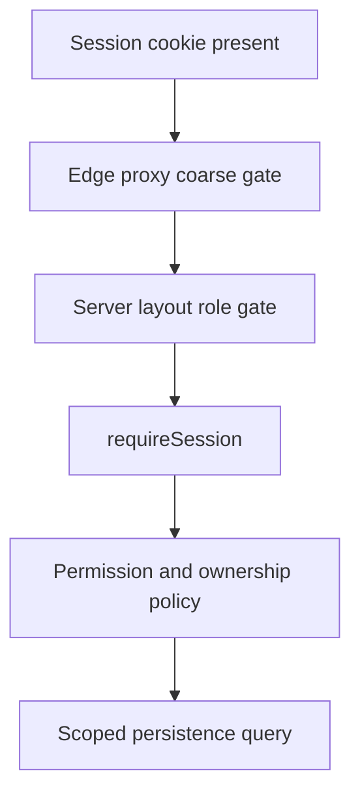
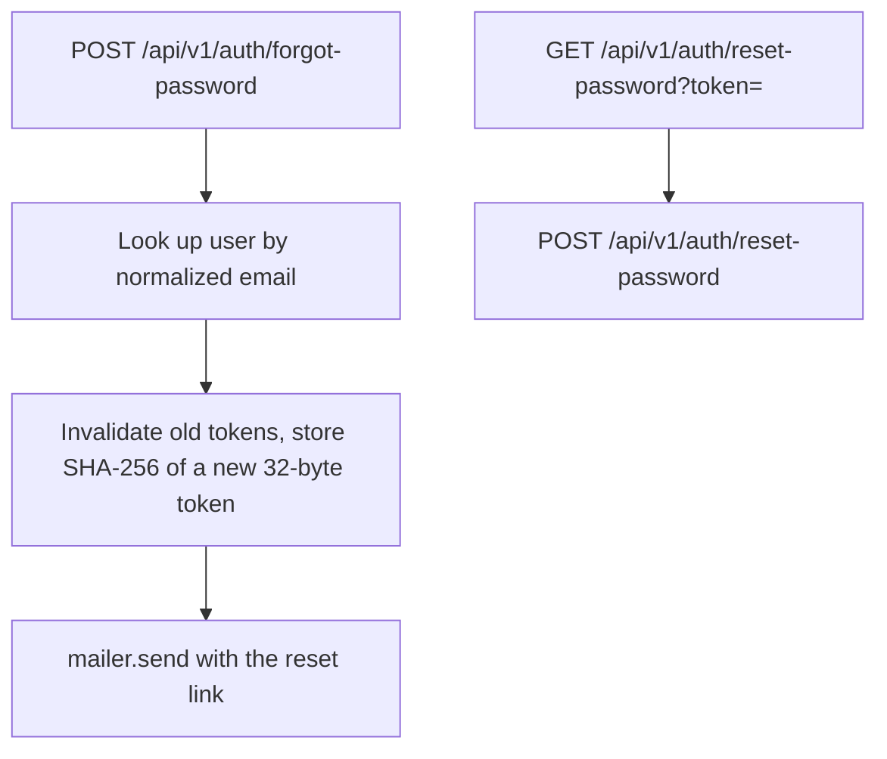

# Authentication and authorization

## Authentication model

Boardly uses Auth.js credentials authentication with JWT sessions.

1. The login payload is validated by `loginSchema`.
2. The user is loaded by normalized email.
3. bcrypt verifies the password hash.
4. Inactive accounts are rejected.
5. Auth.js stores session state in an encrypted, HTTP-only cookie.
6. The session callback exposes id, role, active state, first name, and last name.

Auth.js protocol routes live at `/api/auth/[...nextauth]`; application-oriented wrappers live under
`/api/v1/auth`.

## Roles

### Advertiser

- Access advertiser dashboard
- Read billboard inventory
- Submit, read, and cancel owned reservations
- Create, read, update, and delete owned creatives

### Admin

- Access admin dashboard
- Manage billboard inventory and digital specifications
- Read and moderate reservations
- Read, moderate, and delete creatives
- Manage playlists and schedules
- Preview rotations and read impression analytics
- Manage users where policy permits

The canonical mapping is:

- `src/shared/constants/permissions/permissions.ts`
- `src/shared/constants/permissions/admin-permissions.ts`
- `src/shared/constants/permissions/advertiser-permissions.ts`

## Defense layers



- The proxy only checks cookie presence and must not be treated as authoritative.
- Server layouts prevent users from rendering the wrong dashboard area.
- Authenticated route handlers call `requireSession()`.
- Services assert permissions and ownership even if called outside HTTP.
- Repositories receive already-scoped filters where appropriate.

## Ownership rules

- Advertisers see only their own bookings and creatives.
- Admin reservation creation, booking moderation, and creative moderation are permission-based.
- Public billboard projections omit internal operational fields.
- Server-generated actor ids override any client ownership claim.
- Booking prices are derived from current billboard data, not request totals.

## Session and token behavior

The JWT stores an opaque refresh token and short-lived opaque access token metadata. These tokens
are not currently used to call a separate resource server; they support the session API contract.

Required TTL configuration:

- `ACCESS_TOKEN_TTL_MS`
- `REFRESH_TOKEN_TTL_MS`

An expired refresh token sets `session.error` to `RefreshTokenExpired`. Missing refresh metadata
sets `RefreshTokenMissing`.

## Password handling

- Passwords are never stored directly.
- bcrypt hashes are excluded from default Mongoose queries.
- `SALT_ROUNDS` controls the bcrypt work factor.
- API errors must not reveal whether a specific email exists.
- Logs must never include passwords, hashes, session cookies, tokens, or MongoDB URIs.

### Password policy

`src/shared/contracts/auth/password.schema.ts` is the single source of truth. `PASSWORD_RULES`
drives both `strongPasswordSchema` (server rejection) and the browser strength meter, so the
checklist a user sees cannot drift from what the server accepts.

- 8–128 characters, no leading or trailing whitespace
- At least one lowercase letter, one uppercase letter, and one number
- A symbol raises the strength score but is not required
- A short deny list blocks common credential-stuffing guesses
- Registration additionally rejects passwords containing the user's own name or email handle

Sign-in validates presence only. Applying strength rules at login would lock out accounts created
under an older policy and would leak the current policy to attackers.

## Password reset



Module files live in `src/server/modules/auth/password-reset.*`; delivery goes through the
`src/server/mail` port.

Properties this flow depends on:

- **No account enumeration.** Unknown, inactive, and rate-limited addresses all return the same
  success message. Delivery failures are logged, never surfaced.
- **Tokens are stored hashed.** Only the SHA-256 digest is persisted, so a database leak does not
  yield usable links.
- **Single use, time limited.** `PASSWORD_RESET_TTL_MS` (default one hour) bounds validity; a
  successful reset consumes every outstanding token for that user, as does issuing a new one.
- **Rate limited.** Five requests per client per 15 minutes at the route, plus five per account per
  hour in the service.
- **No password reuse.** The new password is compared against the current hash and rejected if
  unchanged.

Without `RESEND_API_KEY` the mailer prints the message to the server log instead of sending it.
Production deployments must set `RESEND_API_KEY` and `MAIL_FROM`, or **no user can ever complete a
reset** — the link is generated correctly but never reaches them.

### Development link preview

Because a log-only link cannot be followed through the UI, `POST /forgot-password` also returns the
link itself (`previewUrl`) — and, when no link was issued, the reason (`previewNote`). Both are
gated behind `mailer.allowsLinkPreview()`:

```
NODE_ENV !== 'production'  AND  RESEND_API_KEY is unset
```

This deliberately breaks the no-enumeration guarantee, so the gate is the security control. It is
covered by `src/server/mail/mailer.test.ts`, which asserts the preview is refused in production,
with a provider configured, and in both combinations. Setting `RESEND_API_KEY` disables it even in
development.

## Public device endpoints

Now-playing and impression ingestion are intentionally unauthenticated in the current
implementation. The impression service validates the billboard → playlist → creative chain, but
that is not device authentication.

Before production screen deployment, add:

- Per-device credentials or signed requests
- Replay protection
- Rate limiting
- Clock-skew policy
- Device revocation
- Audit logs and anomaly alerts

## Current security priorities

User route files delegate session enforcement to `userController`, which applies `requireSession()`
and service policies. This is protected but less visually obvious than route-level guards; keep
controller tests in place so future refactors do not bypass the gate.

JWT callbacks currently refresh database-backed account state during sign-in, not on every token
callback. Add an explicit revocation/version mechanism if deactivation must terminate active
sessions immediately.

## Security review checklist

- [ ] Every non-public route calls `requireSession()`
- [ ] Every service mutation asserts a permission
- [ ] Ownership uses `actor.id`, never a client-supplied owner id
- [ ] New URLs are restricted to expected protocols and hosts
- [ ] File uploads validate type, size, and destination
- [ ] Error responses do not expose stack traces or internal details
- [ ] Secrets are not logged or committed
- [ ] Public ingestion routes have abuse controls
- [ ] Dependencies and Auth.js beta behavior are reviewed before release
- [ ] Security-sensitive changes receive a second reviewer
